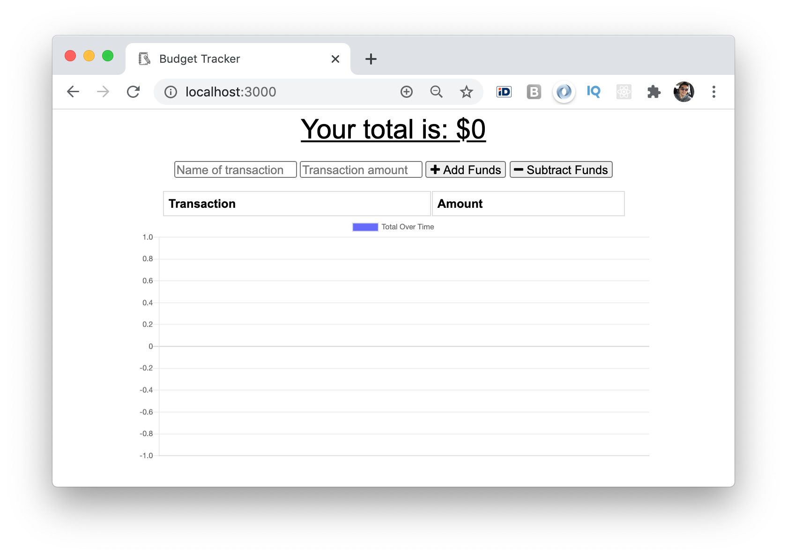
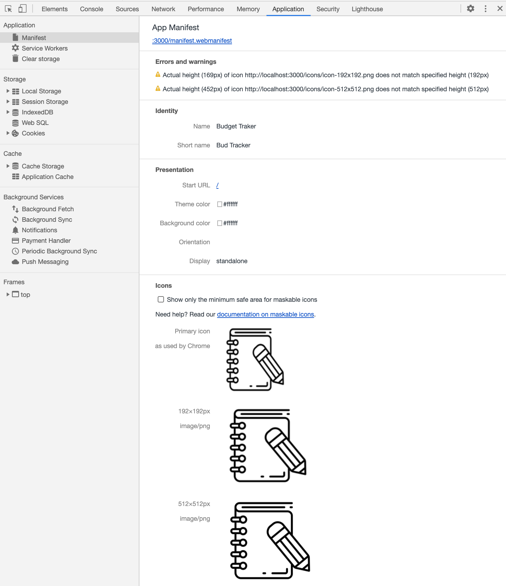
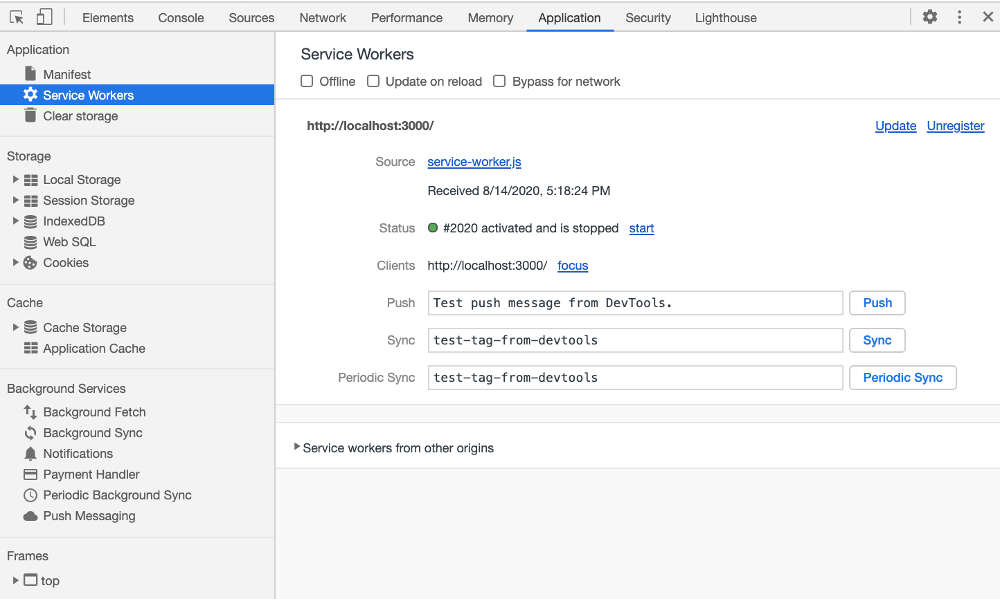
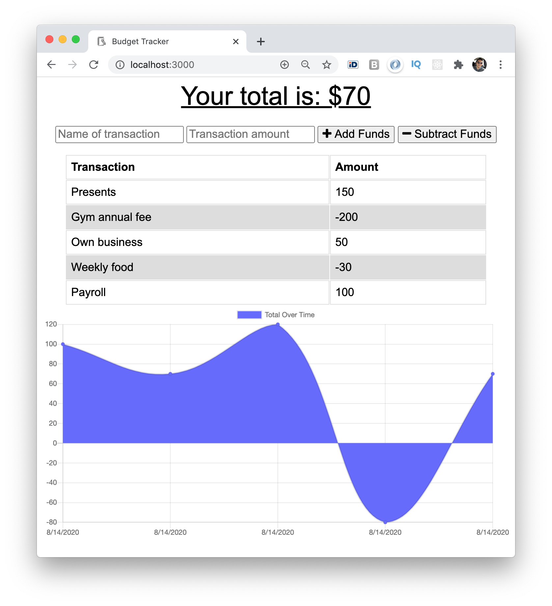
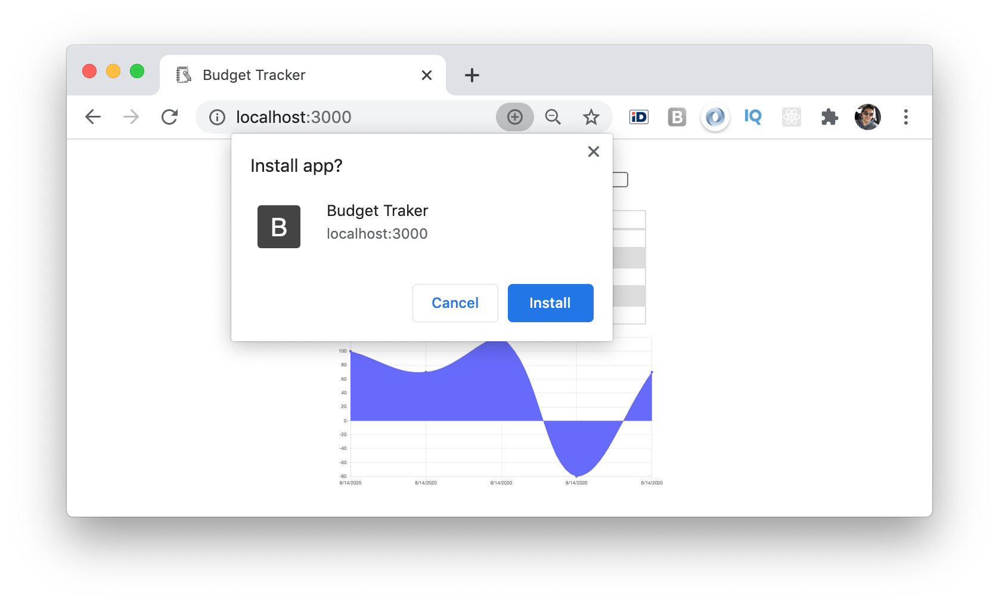
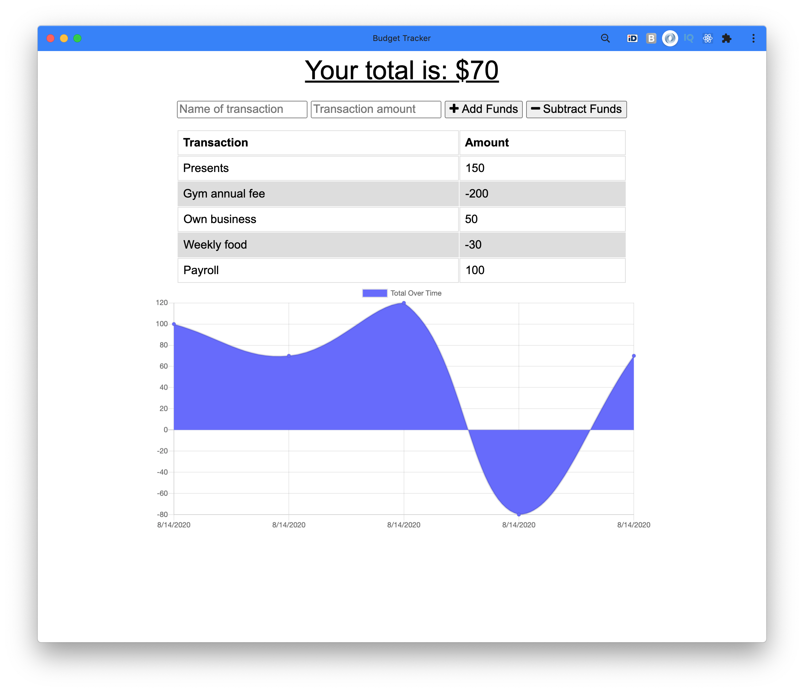
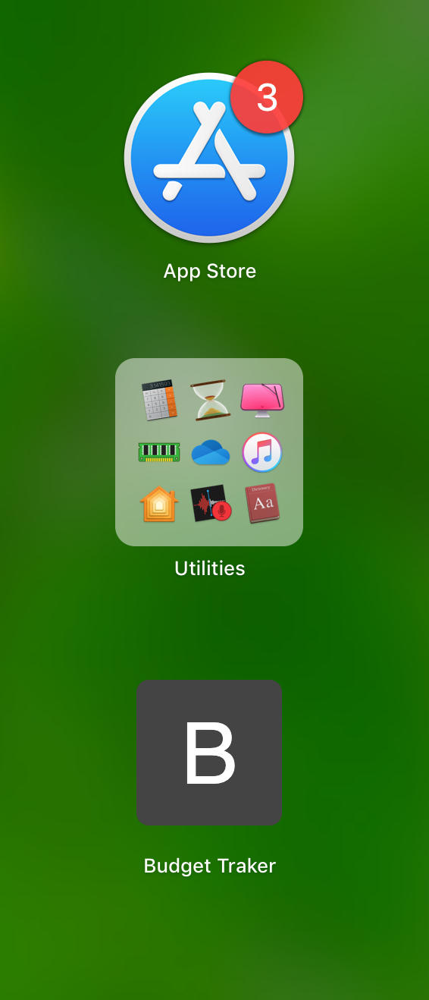

# Online / Offline Budget Trackers

The Budget Tracker is a Progressive Web Application (PWA) where the user can register deposits and expenses transactions. The application continue working its main functionality even in cases where the connection to internet is off, and will update the Mongo database once the conection is back.

Additionally, an icon can be added to the desktop or mobile devices to simulate native applications behavior.

## Badges

Code quality and validation

Repository Status

License

## Table of contents

- [Online / Offline Budget Trackers](#online--offline-budget-trackers)
  - [Badges](#badges)
  - [Table of contents](#table-of-contents)
  - [The challenge](#the-challenge)
  - [The development process](#the-development-process)
  - [The Output](#the-output)
  - [Installation and Usage](#installation-and-usage)
  - [Credits, tools and other references](#credits-tools-and-other-references)
  - [Contributing](#contributing)
  - [Questions](#questions)

## The challenge

Given a full stack running application, the challenge is to add functionality to allow the offline access.

Main elements:

- [x] PWA application that can work offline
- [x] Option to add the application to mobile device's home screen or desktops
- [x] Web manifest
- [x] Service worker
- [x] IndexDB to support offline data handling
- [x] MVC model application
- [x] HTML, CSS, JS front end
- [x] Chart.js visualization
- [x] Mongo Database
- [x] Mongoose model schema
- [x] Express routing and server

## The development process

In order to accomplish the challenge, the following steps were done:

1. Review the provided full stack application, its functionality and API requests.
2. Create the manifest.
3. Create the service worker.
4. Implement IndexDB functionality.
5. Tests online and offline.
6. Final review and proper documentation.

## The Output

With the described process we were able to create an engaging Prgressive Web Application.

**User stories**

AS an avid traveller I WANT to be able to track my withdrawals and deposits with or without a data/internet connection SO THAT my account balance is accurate when I am traveling.

AS a user I WANT to be able to add the application's icon into my mobile's home screen or in my computer's desktop, SO THAT I can launch the application directly from the icon and will behave like a native application.

**The application**

## Installation and Usage

The project was uploaded to [GitHub](https://github.com/) at the following repository:
[https://github.com/jorguzman100/18_Online_Offline_Budget_Tracker](https://github.com/jorguzman100/18_Online_Offline_Budget_Tracker)

You can access the deployed application with the Heroku link:
[https://secure-plateau-99167.herokuapp.com/](https://secure-plateau-99167.herokuapp.com/)

To install the project follow these steps:

1. Clone the application from GitHub with:
   - git clone [clone link from GitHub]
2. From the root folder, install the dependencies with:
   - npm install
3. Run the app with:
   - node server.js

## Credits, tools and other references

**Third Party Assets**

[Chart.js](https://www.chartjs.org/)

[Shields.io](https://shields.io/)

[LGTM](https://lgtm.com/)

[Markup Validation Service](https://validator.w3.org/)

## Contributing

- Pull requests are welcome.
- For major changes, please open an issue first to discuss what you would like to change.
- Please make sure to update tests as appropriate.

## Questions

If you have questions or you want to share comments, we will be glad to hear from you. Please contact us at jorguzman100@gmail.com.
